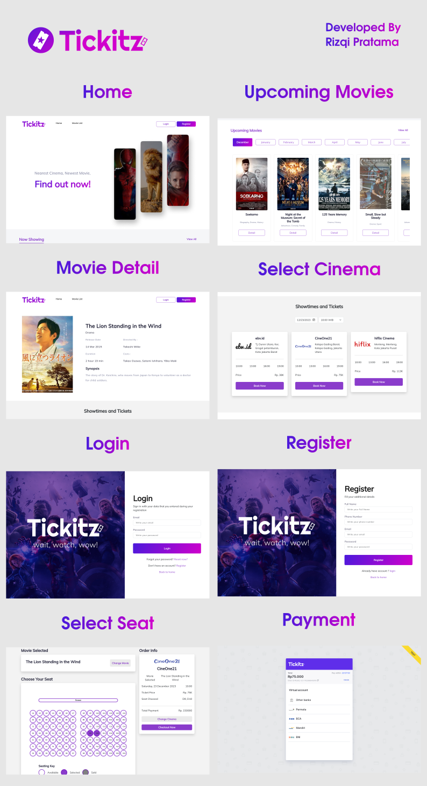

# Tickitz fe  


It's a tickitz frontend. learning base project from pijarcamp. This a movie cinema ticketing app, you can see current month movie show, and upcoming movie on next month. also this project was integrating with midtrans payment gateway on sandbox environment.  

Developer : Rizqi Pratama  
Tech Stack : Javascript, ReactJS, React Router, Bootstrap, Midtrans Payment Gateway  
Preview : <https://tickitz-app.vercel.app>

> Note: Because of limitation from backend cloud provider, the page data is slow to load.  
> Sorry for the inconvenience.

## Table of content

- [Tickitz fe](#tickitz-fe)
	- [Table of content](#table-of-content)
	- [Screenshoot](#screenshoot)
	- [How to run](#how-to-run)
	- [Runtime Requirement](#runtime-requirement)
	- [Issue](#issue)
		- [Known Issue](#known-issue)
		- [Fixed Recent Issue](#fixed-recent-issue)

## Screenshoot



## How to run

```bash
# Setup the db using postgres
# Configure the dot env

# run on development
npm run start

# run on production
npm run build
serve -s build

```

## Runtime Requirement

- Serve  
``npm install -g serve``

## Issue

### Known Issue

- [ ] Unselect seat still not working on select seat page
- [ ] Backend Issue, OnRender free limitation.

### Fixed Recent Issue

- [x] No loading indicator
- [x] No error handler
- [x] change movie button above checkout button not associated
- [x] still can't marked booked seat
- [x] still can't marked selected item
- [x] still no error message on select seat page
- [x] there unresponsive page
